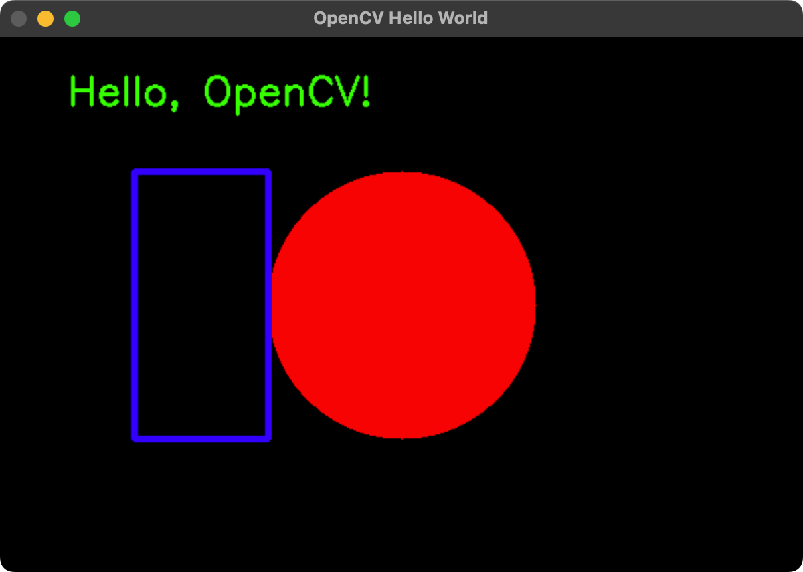

# opencv_cpp_hello_world

<!--  -->

<a href="./screenshot.png"></a>

## (Option 1) Build with vcpkg

```bash
$ ./scripts/setup_vcpkg.sh
$ ./scripts/build_with_vcpkg.sh

$ ./scripts/run.sh
```

- **NOTE (1)**: This takes much time than other methods. But most stable and compatible with many environments.
- **NOTE (2)**: This can be used build with MSVC on git-bash on Windows. CMake is required.

## (Option 2) Build with Homebrew (macOS)

```bash
$ ./scripts/setup_brew.sh
$ ./scripts/build_with_brew.sh

$ ./scripts/run.sh
```

## (Option 3) Build with msys2 (Windows)

**NOTE**: run with MSYS2 ***MINGW64*** shell.

```bash
$ ./scripts/setup_msys2.sh
$ ./scripts/build_with_msys2.sh

$ ./scripts/run.sh
```

## (Option 4) Build with apt (Linux/Ubuntu)

```bash
$ ./scripts/setup_apt.sh
$ ./scripts/build_with_apt.sh

$ ./scripts/run.sh
```